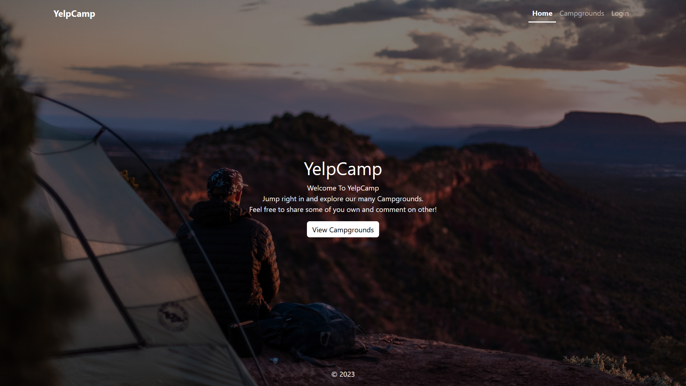
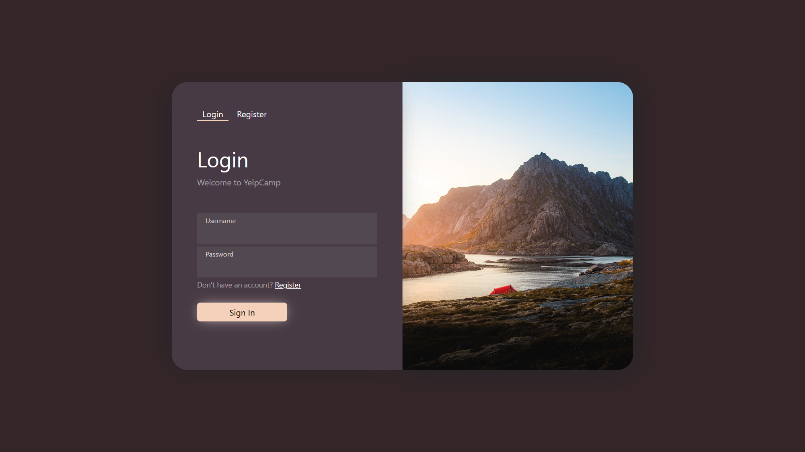
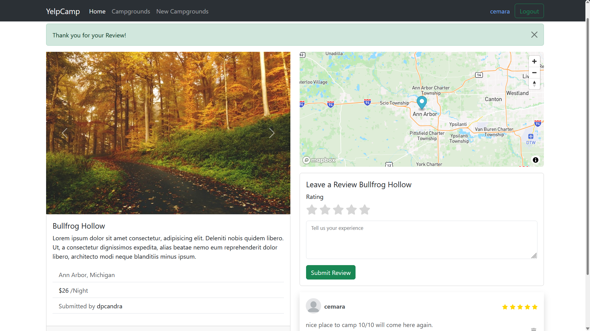

# yelp-camp
WebDev Bootcamp Colt Udemy Yelp camp project

this app build using nodeJs
## Backend
NodeJs, Express, MongoDb, Mongoose, Compass

## Frontend
HTML, CSS, JavaScript, Bootstrap 5.3

## dependencies: 
    @mapbox/mapbox-sdk: ^0.15.2,
    body-parser: ^1.20.2,
    bootstrap: ^5.3.0,
    cloudinary: ^1.37.3,
    connect-flash: ^0.1.1,
    dotenv: ^16.3.1,
    ejs: ^3.1.9,
    ejs-mate: ^4.0.0,
    express: ^4.18.2,
    express-session: ^1.17.3,
    joi: ^17.9.2,
    method-override: ^3.0.0,
    mongoose: ^7.2.2,
    multer: ^1.4.5-lts.1,
    multer-storage-cloudinary: ^4.0.0,
    passport: ^0.6.0,
    passport-local: ^1.0.0,
    passport-local-mongoose: ^8.0.0
